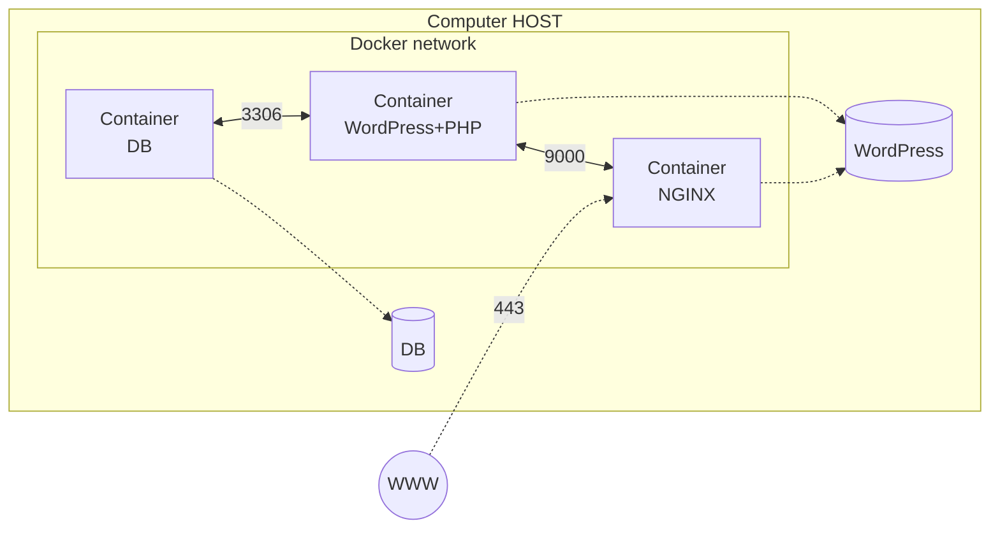

*This project has been created as part of the 42 curriculum by spacotto.*

## Description
Inception is a **System Administration project** that introduces you to **Docker and containerization**. The main goal is to **set up a small web infrastructure using Docker Compose** on a virtual machine(VM). Instead of installing all software directly on the machine, three separate containers are configured, each running a specific service: a web server (NGINX), a database (MariaDB), and a content management system (WordPress). This modular approach ensures that each service is isolated, making the system more secure, easier to manage, and scalable. By building the system from the ground up, the project teaches you how to create custom Docker images, configure secure networking between containers, and properly manage persistent data storage.

## Instructions
section containing any relevant information about compilation, installation, and/or execution.

## Project description
section must also explain the use of Docker and the sources included in the project. It must indicate the main design choices, as well as a comparison between:

### Virtual Machines vs Docker

### Secrets vs Environment Variables

### Docker Network vs Host Network

### Docker Volumes vs Bind Mounts

## Resources
section listing classic references related to the topic (documentation, articles, tutorials, etc.), as well as a description of how AI was used — specifying for which tasks and which parts of the project.

### AI Usage
