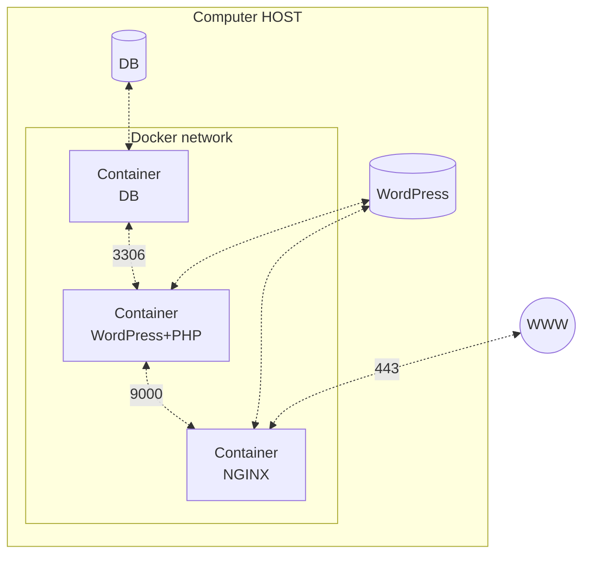

*This project has been created as part of the 42 curriculum by spacotto.*

## Description

Inception is a **System Administration project** that introduces you to **Docker and containerization**. The main goal is to **set up a small web infrastructure using Docker Compose** on a virtual machine(VM). Instead of installing all software directly on the machine, three separate containers are configured, each running a specific service: a web server (NGINX), a database (MariaDB), and a content management system (WordPress). This modular approach ensures that each service is isolated, making the system more secure, easier to manage, and scalable. By building the system from the ground up, the project teaches you how to create custom Docker images, configure secure networking between containers, and properly manage persistent data storage.

## Instructions

To build and launch the infrastructure from scratch, ensure you are running a Linux Virtual Machine (Alpine) with Docker, Git, and Make installed.

### Setup environment variables and secrets

- Copy `srcs/.env.example` to `srcs/.env` and replace the placeholder values.
- Copy the `secrets_example/` folder to `secrets/` and replace the passwords in the `.txt` files.

### Build the infrastructure

For detailed development and usage documentation, please refer to [DEV_DOC.md](DEV_DOC.md) and [USER_DOC.md](USER_DOC.md).

## Project description

This project leverages Docker to containerize the infrastructure, providing an isolated and reproducible environment for each service. The included sources comprise Dockerfiles and configuration files for NGINX, WordPress, and MariaDB, all orchestrated via `docker-compose.yml`. The main design choice was to adopt a modular approach by isolating each component—web server, application, and database—into its own container. Persistent data is managed using dedicated Docker volumes to ensure database and website files survive container restarts.



### Expected Project Structure

```bash
.
├── Makefile
├── README.md
├── DEV_DOC.md
├── USER_DOC.md
├── secrets    # Do NOT share!!! Add to .gitignore!
|   ├── credentials.txt
|   ├── db_password.txt
|   └── db_root_password.txt
└── srcs
    ├── .env    # Do NOT share!!! Add to .gitignore!
    ├── docker-compose.yml
    └── requirements
        ├── bonus    # Not mandatory
        ├── mariadb
        │   ├── conf
        |   |   └── ...
        │   ├── tools
        |   |   └── ...
        │   ├── Dockerfile
        │   └── .dockerignore
        ├── nginx
        │   ├── conf
        |   |   └── ...
        │   ├── tools
        |   |   └── ...
        │   ├── Dockerfile
        │   └── .dockerignore
        ├── wordpress
        │   ├── conf
        |   |   └── ...
        │   ├── tools
        |   |   └── ...
        │   ├── Dockerfile
        │   └── .dockerignore
        └── tools
```

The directory structure required by the project subject is not arbitrary; it is specifically designed to enforce separation of concerns, modularity, and build security.

| Directory / Level      | Pertinence and Architectural Benefit                                                                                                                                                                                                           |
| ---------------------- | ---------------------------------------------------------------------------------------------------------------------------------------------------------------------------------------------------------------------------------------------- |
| **`srcs/` vs Root**    | The `docker-compose.yml` and all build files are nested inside `srcs/` to keep the project root clean for documentation, global variables (like `secrets`), and the global `Makefile`.                                                         |
| **`requirements/`**    | Isolates each service (`mariadb`, `nginx`, `wordpress`) into its own dedicated folder, ensuring each service is self-contained.                                                                                                                |
| **`conf/` & `tools/`** | Cleanly separates static configuration files (`nginx.conf`, `www.conf`) from dynamic initialization scripts (`docker-entrypoint.sh`).                                                                                                          |
| **Build Context**      | This strict hierarchy ensures that each container's Docker build context is as small as possible. It physically prevents configuration files or sensitive scripts from one service from accidentally leaking into the Docker image of another. |

### Virtual Machines vs Docker

| Feature          | Virtual Machines (VMs)                            | Docker (Containers)                             |
|:---------------- |:------------------------------------------------- |:----------------------------------------------- |
| **Architecture** | Emulates full hardware; runs a complete guest OS. | Shares the host OS kernel; no guest OS needed.  |
| **Performance**  | High resource overhead (CPU, RAM, storage).       | Lightweight and highly efficient.               |
| **Startup Time** | Slow (takes minutes to boot the OS).              | Fast (starts in milliseconds/seconds).          |
| **Isolation**    | Strong, hardware-level isolation.                 | Process-level isolation via namespaces/cgroups. |
| **Portability**  | Hardware/Hypervisor dependent; difficult to move. | "Build once, run anywhere"; highly portable.    |
| **Density**      | Low; limited by the massive overhead of each VM.  | High; you can run many containers on one host.  |

### Docker vs. Docker Compose

**Docker** is a **platform that uses OS-level virtualization to deliver software in packages called containers**. Containers are isolated from one another and bundle their own software, libraries, and configuration files. They share the host's operating system kernel, making them incredibly lightweight compared to full virtual machines.

**Docker Compose** is an **orchestration tool** for defining and running multi-container Docker applications. It uses a single YAML file (`docker-compose.yml`) to configure the application's services, networks, volumes, and secrets. With a single command, you can predictably create and start all the services as a unified infrastructure. While both tools are part of the same ecosystem, they serve distinct purposes in the lifecycle of a containerized application. An image itself is entirely identical regardless of which method you use; the difference lies strictly in how the container is instantiated and managed.

| Feature              | Vanilla Docker CLI                                                                                                        | Docker Compose                                                                                             |
|:-------------------- |:------------------------------------------------------------------------------------------------------------------------- |:---------------------------------------------------------------------------------------------------------- |
| **Primary Scope**    | Managing individual containers, images, and volumes one by one.                                                           | Orchestrating multi-container applications as a unified system.                                            |
| **Execution**        | Requires long, complex, and error-prone commands (e.g., `docker run -d -p 443:443 --network my-net -v vol:/var/www ...`). | Requires a single, simple command (`docker compose up -d`).                                                |
| **Configuration**    | Passed entirely through command-line arguments at runtime.                                                                | Defined declaratively in a `docker-compose.yml` file.                                                      |
| **Reproducibility**  | Low; relies on the user remembering the exact CLI flags and execution order.                                              | High; the YAML file acts as documentation and guarantees identical deployments.                            |
| **The Docker Image** | *Identical.* An image built or run with `docker run` is structurally exactly the same as one run with Compose.            | *Identical.* Compose simply automates the networking, volumes, and environment variables injected into it. |

So, **what is difference between a Docker image used with docker compose and without docker compose**? To be absolutely clear: **there is zero difference in the underlying Docker image itself**. 

Whether you build an image via the `docker build` command or via `docker-compose build`, the resulting binary artifact is exactly the same. The difference strictly lies in **the deployment context**. 

When an image is used **without Docker Compose**, it is isolated by default. The administrator must manually inject every environment variable, mount every volume, and manually attach it to custom networks using massive, tedious CLI commands (`docker run -d --name nginx -p 443...`).

When the exact same image is used **with Docker Compose**, it is deployed as part of a cohesive "stack". The `docker-compose.yml` file acts as a manifest that automatically manages the complex lifecycle (building, injecting secrets, attaching networks, binding volumes, and resolving dependencies like `depends_on`). Compose doesn't change the image; it simply orchestrates the environment *around* the image.

### Secrets vs Environment Variables

| Feature       | Docker Secrets                                             | Environment Variables                                                        |
|:------------- |:---------------------------------------------------------- |:---------------------------------------------------------------------------- |
| **Security**  | High (encrypted at rest, mounted in-memory only).          | Low (stored in plain text, visible to child processes and `docker inspect`). |
| **Use Case**  | Passwords, API keys, TLS certificates, SSH keys.           | General configuration, debug flags, non-sensitive URLs.                      |
| **Lifecycle** | Explicitly managed; cannot be easily altered once running. | Can be passed at runtime via `.env` files or CLI flags.                      |

### Docker Network vs Host Network

**What is a Docker Network?** Think of a Docker network as a private, virtual LAN (Local Area Network) created exclusively for your containers. Instead of connecting your containers directly to your computer's main network (where everything is dangerously exposed), Docker builds an invisible, isolated router inside your machine.

Containers attached to this custom network can talk to each other securely using their container names as hostnames (e.g., WordPress can securely connect to `mariadb`), but they remain completely invisible to the outside world unless you explicitly punch a hole through the firewall (like we did by exposing port 443 for NGINX).

| Feature            | Docker Network (e.g., bridge, custom)                     | Host Network                                             |
|:------------------ |:--------------------------------------------------------- |:-------------------------------------------------------- |
| **Isolation**      | High (creates a private internal network for containers). | None (shares the host's networking namespace).           |
| **Port Conflicts** | Solved by mapping specific container ports to host ports. | High risk (containers bind directly to host interfaces). |
| **Security**       | Internal communication is hidden from the host network.   | All container ports are fully exposed on the host.       |

### Docker Volumes vs Bind Mounts

| Feature              | Docker Volumes                                          | Bind Mounts                                                    |
|:-------------------- |:------------------------------------------------------- |:-------------------------------------------------------------- |
| **Storage Location** | Managed by Docker (e.g., `/var/lib/docker/volumes/`).   | User-specified path anywhere on the host machine.              |
| **Portability**      | High (independent of host directory structure).         | Low (relies on specific host paths existing).                  |
| **Management**       | Fully managed via Docker CLI (`docker volume ...`).     | Managed manually via the host OS file system.                  |
| **Best For**         | Persisting database data, cross-container data sharing. | Injecting config files, live-reloading source code during dev. |

## Resources

- [System administration](https://en.wikipedia.org/wiki/System_administrator)
- [Virtual machine](https://en.wikipedia.org/wiki/Virtual_machine)
- [OS-level virtualization (Containerization)](https://en.wikipedia.org/wiki/OS-level_virtualization)
- [Docker](https://en.wikipedia.org/wiki/Docker_(software))
- [Alpine Linux](https://en.wikipedia.org/wiki/Alpine_Linux)
- [Debian](https://en.wikipedia.org/wiki/Debian)
- [Daemon (computing)](https://en.wikipedia.org/wiki/Daemon_(computing))
- [Init (PID 1)](https://en.wikipedia.org/wiki/Init)
- [Transport Layer Security (TLS)](https://en.wikipedia.org/wiki/Transport_Layer_Security)
- [Nginx](https://en.wikipedia.org/wiki/Nginx)
- [WordPress](https://en.wikipedia.org/wiki/WordPress)
- [PHP](https://en.wikipedia.org/wiki/PHP)
- [MariaDB](https://en.wikipedia.org/wiki/MariaDB)

### AI Usage
