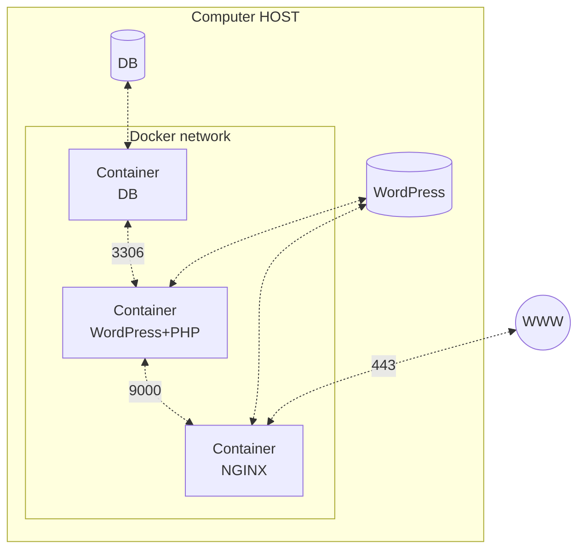

*This project has been created as part of the 42 curriculum by spacotto.*

## Description

Inception is a **System Administration project** that introduces you to **Docker and containerization**. The main goal is to **set up a small web infrastructure using Docker Compose** on a virtual machine(VM). Instead of installing all software directly on the machine, three separate containers are configured, each running a specific service: a web server (NGINX), a database (MariaDB), and a content management system (WordPress). This modular approach ensures that each service is isolated, making the system more secure, easier to manage, and scalable. By building the system from the ground up, the project teaches you how to create custom Docker images, configure secure networking between containers, and properly manage persistent data storage.

## Instructions

To build and launch the infrastructure from scratch, ensure you are running a Linux Virtual Machine (Alpine) with Docker, Git, and Make installed.

### Setup environment variables and secrets

- Copy `srcs/.env.example` to `srcs/.env` and replace the placeholder values.
- Copy the `secrets_example/` folder to `secrets/` and replace the passwords in the `.txt` files.

### Build the infrastructure

For detailed development and usage documentation, please refer to [DEV_DOC.md](DEV_DOC.md) and [USER_DOC.md](USER_DOC.md).

## Project description

This project leverages Docker to containerize the infrastructure, providing an isolated and reproducible environment for each service. The included sources comprise Dockerfiles and configuration files for NGINX, WordPress, and MariaDB, all orchestrated via `docker-compose.yml`. The main design choice was to adopt a modular approach by isolating each component—web server, application, and database—into its own container. Persistent data is managed using dedicated Docker volumes to ensure database and website files survive container restarts.



### Expected Project Structure

```bash
.
├── Makefile
├── README.md
├── DEV_DOC.md
├── USER_DOC.md
├── secrets    # Do NOT share!!! Add to .gitignore!
|   ├── credentials.txt
|   ├── db_password.txt
|   └── db_root_password.txt
└── srcs
    ├── .env    # Do NOT share!!! Add to .gitignore!
    ├── docker-compose.yml
    └── requirements
        ├── bonus    # Not mandatory
        ├── mariadb
        │   ├── conf
        |   |   └── ...
        │   ├── tools
        |   |   └── ...
        │   ├── Dockerfile
        │   └── .dockerignore
        ├── nginx
        │   ├── conf
        |   |   └── ...
        │   ├── tools
        |   |   └── ...
        │   ├── Dockerfile
        │   └── .dockerignore
        ├── wordpress
        │   ├── conf
        |   |   └── ...
        │   ├── tools
        |   |   └── ...
        │   ├── Dockerfile
        │   └── .dockerignore
        └── tools
```

### Alpine vs Debian

For this project, **Alpine Linux 3.19** (the penultimate stable version, as required by the subject) was chosen as the base image for all containers.

| Feature             | Alpine Linux                                                                                  | Debian                                                           |
|:------------------- |:--------------------------------------------------------------------------------------------- |:---------------------------------------------------------------- |
| **Size**            | Extremely small (base image is ~5MB).                                                         | Larger (base image is ~100MB+).                                  |
| **Package Manager** | `apk` (fast and simple).                                                                      | `apt` (feature-rich and widely used).                            |
| **C Library**       | `musl libc` (lightweight but can cause compatibility issues with some pre-compiled binaries). | `glibc` (standard, highly compatible).                           |
| **Security**        | Minimal surface area for attacks due to small footprint.                                      | Larger attack surface, but benefits from rapid security updates. |

> [!IMPORTANT]
> **Why Alpine?** Alpine has been chosen for its minimal footprint, which speeds up build times and reduces overhead, perfectly aligning with the project's performance requirements. While more standard and easier for beginners, Debian is too heavy for the strict resource optimization goals of this setup.

### Virtual Machines vs Docker

| Feature          | Virtual Machines (VMs)                            | Docker (Containers)                             |
|:---------------- |:------------------------------------------------- |:----------------------------------------------- |
| **Architecture** | Emulates full hardware; runs a complete guest OS. | Shares the host OS kernel; no guest OS needed.  |
| **Performance**  | High resource overhead (CPU, RAM, storage).       | Lightweight and highly efficient.               |
| **Startup Time** | Slow (takes minutes to boot the OS).              | Fast (starts in milliseconds/seconds).          |
| **Isolation**    | Strong, hardware-level isolation.                 | Process-level isolation via namespaces/cgroups. |

### Secrets vs Environment Variables

| Feature       | Docker Secrets                                             | Environment Variables                                                        |
|:------------- |:---------------------------------------------------------- |:---------------------------------------------------------------------------- |
| **Security**  | High (encrypted at rest, mounted in-memory only).          | Low (stored in plain text, visible to child processes and `docker inspect`). |
| **Use Case**  | Passwords, API keys, TLS certificates, SSH keys.           | General configuration, debug flags, non-sensitive URLs.                      |
| **Lifecycle** | Explicitly managed; cannot be easily altered once running. | Can be passed at runtime via `.env` files or CLI flags.                      |

### Docker Network vs Host Network

| Feature            | Docker Network (e.g., bridge, custom)                     | Host Network                                             |
|:------------------ |:--------------------------------------------------------- |:-------------------------------------------------------- |
| **Isolation**      | High (creates a private internal network for containers). | None (shares the host's networking namespace).           |
| **Port Conflicts** | Solved by mapping specific container ports to host ports. | High risk (containers bind directly to host interfaces). |
| **Security**       | Internal communication is hidden from the host network.   | All container ports are fully exposed on the host.       |

### Docker Volumes vs Bind Mounts

| Feature              | Docker Volumes                                          | Bind Mounts                                                    |
|:-------------------- |:------------------------------------------------------- |:-------------------------------------------------------------- |
| **Storage Location** | Managed by Docker (e.g., `/var/lib/docker/volumes/`).   | User-specified path anywhere on the host machine.              |
| **Portability**      | High (independent of host directory structure).         | Low (relies on specific host paths existing).                  |
| **Management**       | Fully managed via Docker CLI (`docker volume ...`).     | Managed manually via the host OS file system.                  |
| **Best For**         | Persisting database data, cross-container data sharing. | Injecting config files, live-reloading source code during dev. |

## Resources

- [System administration](https://en.wikipedia.org/wiki/System_administrator)
- [Virtual machine](https://en.wikipedia.org/wiki/Virtual_machine)
- [OS-level virtualization (Containerization)](https://en.wikipedia.org/wiki/OS-level_virtualization)
- [Docker](https://en.wikipedia.org/wiki/Docker_(software))
- [Alpine Linux](https://en.wikipedia.org/wiki/Alpine_Linux)
- [Debian](https://en.wikipedia.org/wiki/Debian)
- [Daemon (computing)](https://en.wikipedia.org/wiki/Daemon_(computing))
- [Init (PID 1)](https://en.wikipedia.org/wiki/Init)
- [Transport Layer Security (TLS)](https://en.wikipedia.org/wiki/Transport_Layer_Security)
- [Nginx](https://en.wikipedia.org/wiki/Nginx)
- [WordPress](https://en.wikipedia.org/wiki/WordPress)
- [PHP](https://en.wikipedia.org/wiki/PHP)
- [MariaDB](https://en.wikipedia.org/wiki/MariaDB)

### AI Usage
